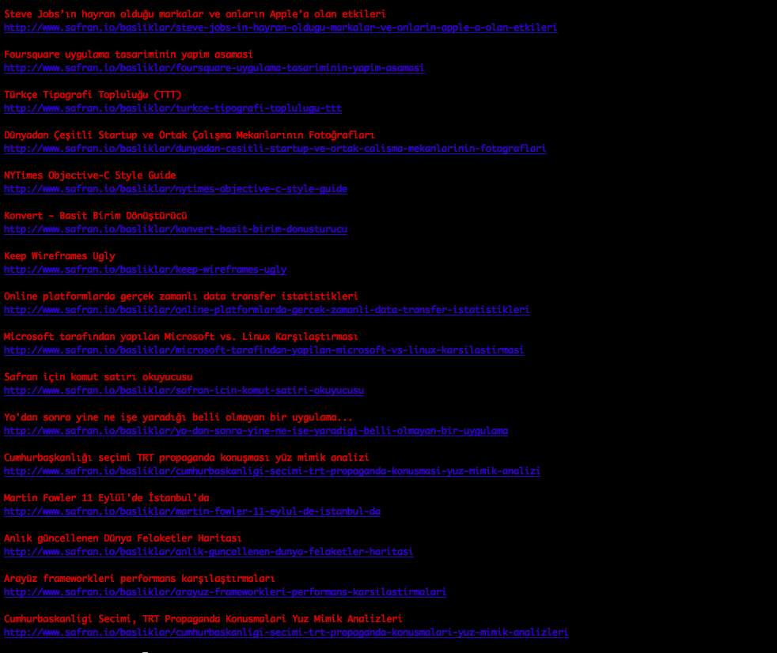

# Safran Ruby CLı

[Safran.io](http://safran.io) için Ruby ile yazılmış Command Line okuyucusu.

Node.js ile yazılmış versiyonu için [safran-cli](https://github.com/f/safran-cli)

## Kurulum

```bash
gem install safran
```

## Kullanım

```bash
safran
```

## Screenshot



## Safran Nedir?

[http://www.safran.io/hakkinda](http://www.safran.io/hakkinda) sayfasından:

> Safran yaratıcı servisler ve ürünler tasarlayan/geliştiren topluluklar için düşünülmüş, şimdilik sadece davetlilere açık bir sosyal haber ve paylaşım ağıdır. Severek takip ettiğimiz Hacker News ve Designer News gibi sitelerin Türkçe konuşanlar için bir uyarlamasıdır.

## Lisans

[MIT License](http://f.mit-license.org)